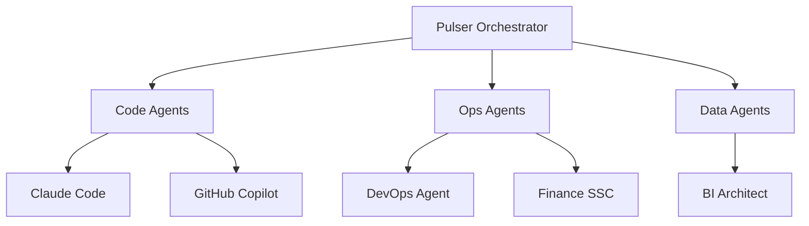

# Agent Taxonomy

## Overview

InsightPulse AI uses multiple agent types across different runtimes for task automation, code generation, and operational intelligence.

## Agent Classification

## Agent Types

| Agent | Runtime | Purpose | Status |
|-------|---------|---------|--------|
| Claude Code | Local/Web | Code generation, PR agent | Active |
| Copilot | GitHub | Code completions, PR summaries | Active |
| DevOps Engineer | DO App Platform | DevOps automation | Active |
| BI Architect | DO App Platform | Analytics automation | Active |
| Finance SSC | DO App Platform | Finance operations | Active |
| Odoo Developer | DO App Platform | Odoo module development | Active |

## Key Files

- Agent configs: `agents/` directory
- MCP servers: `mcp/servers/`
- Pulser core: `packages/agent-core/`

## Related Docs

- MCP architecture: `MCP_ARCHITECTURE.md` (to be created)
- Pulser system: `PULSER_SYSTEM.md` (to be created)
- Full agent reference: see `odoo` repo `docs/ai/`
